# Setting thins up with firebase and firestore

- install node js from [Node js](<http://nodejs.org/>)
- install any javascript IDE or Text editor - like VS Code [VSCode](<https://code.visualstudio.com/>)
- create a firebase account by simply logging in ot [Firebase Console](<https://firebase.google.com/>) with any designated google account
- add or create a project on firebase console [Firebase Console](<https://firebase.google.com/>)
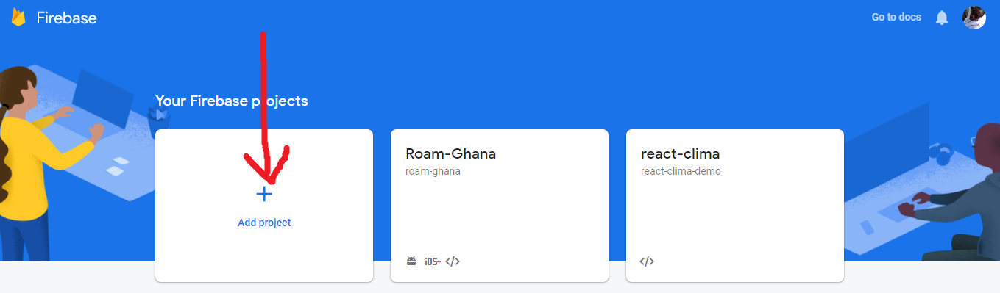
- activate the authentication feature
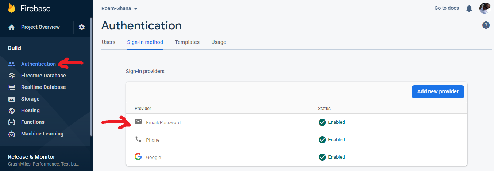
- activate the functions feature
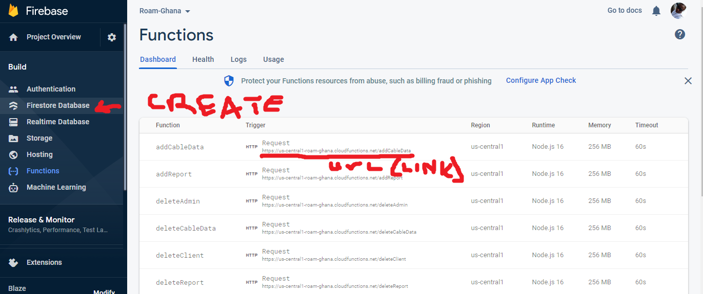
- activate the firestore feature
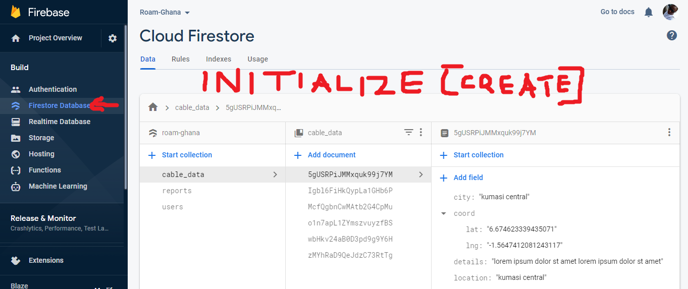
- add a web app to the project
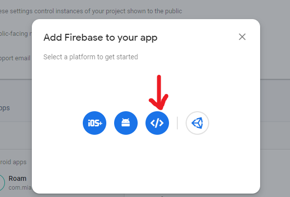
- the above can be done in the firebase console in the project overview screen as well
- navigate to the project overview screen
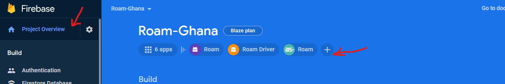
- then select the web app or + icon and select web app
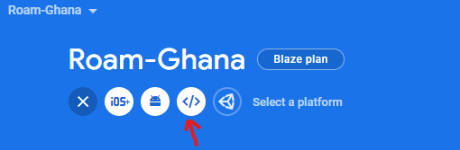
- switch to **Blaze plan** on the project overview page to support firebase functions
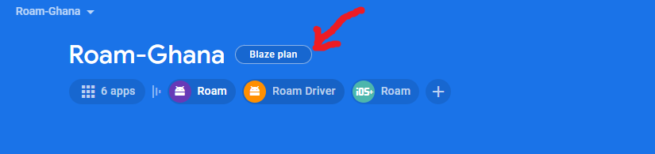
- Note the above require you to add a working payment method (credit card or equivalent to your app)
- get and save the config details somewhere on your local system for later use
- The credentials can be copied from the firebase console
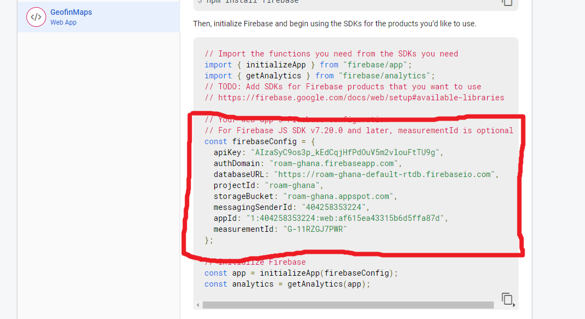

## install the needed dependencies

- download and install git from [Git](<https://git-scm.com/downloads>)
- run the installer and follow the prompt to install (good to leave everything to default)
- check my YouTube channel for installation of git if need be [how to install git on windows](<https://www.youtube.com/watch?v=5ikMpwsuO4Y />)

- open a terminal (git bass or CMD window) [right click on  desktop and select `git bash here`]
- install the React cli with `npm install -g create-react-app`
- (optional) install yarn with `npm install -g yarn`
- install the firebase cli with `npm install -g firebase-tools`
- log in to the firebase cli with the firebase account you created by running `firebase login` and following the prompt

## generate a map api key
- navigate to the [developer console](<https://console.cloud.google.com/apis/dashboard?pli=1/>)
- log in with the same google account used for the firebase account
- make sure the project created on firebase is active on the navbar
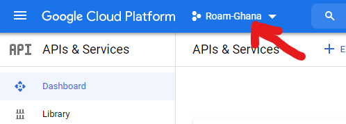
- open the libraries tab
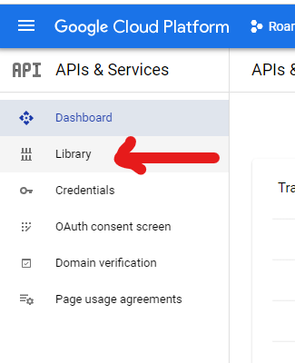
- open and enable the google maps api for javascript
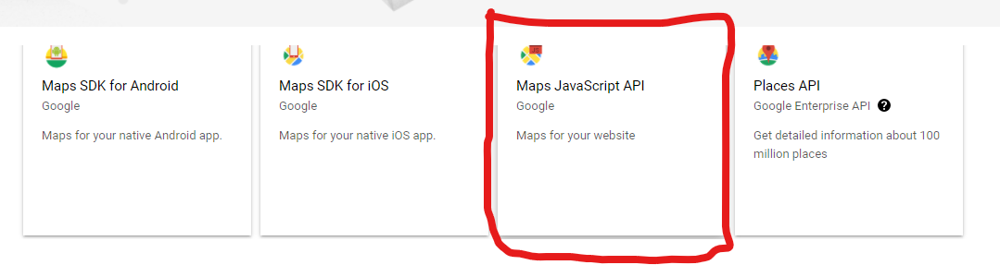
- open the credentials tab
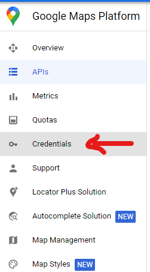
- create a new credentials for web (optional)
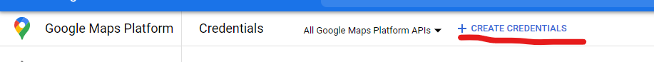
- or copy any of the existing credentials
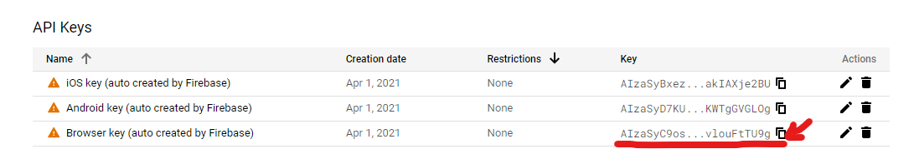
- save the api key somewhere on your local system for later use

## clone this repo 

- navigate to preferred location to clone the repository to and right click and select `git bash here`
- run `git clone https://github.com/musahibrahimali/geofinmaps-mtn.git`
- change directory to the cloned repository with `cd geofinmaps-mtn` or if the directory name changes `cd <directory name>`
- run `npm install` if you chose not to install yarn otherwise run `yarn install`
- if you installed visual studio code run `code .` to open the project in visual studio code
- if not open the project in the IDE of preference by whatever means you prefer
- delete all firebase related files that is [.firebaserc, .firebase.json, .firebase.rules]
- open the integrated terminal of visual studio code with `CTRL + J`
- run `firebase init` in the terminal and select yes to the prompts
- select the third option which is the functions (use arrow keys to navigate and space to select and then hit enter)
- select javascript as the language 
- type in y for yes for the next options (eslint)
- if it says functions/package.json already exists do you want to overide, just hit y for yes and proceed
- hit n for no for the next options
- hit yes for the next options (do you want to install all dependencies with npm now)
- if you wish to install all dependencies with yarn navigate to the **functions** and delete any package.lock file ...
- then in your integrated terminal run `cd functions` and run `yarn install` (this and the above options only apply if you installed yarn)
- once all dependencies are installed run `firebase deploy --only functions`
- wait for the deployment to complete
- if any particular function should encounter any errors use `firebase deploy --only functions:<function name>` example `firebase deploy --only functions:getAllCableData`
- once all is deployed get all the function links
- you can get all the links after the deployment process or navigate to the functions tab on the firebase console and get the links from the functions on the dashboard
- replace the function links in the .env file with the links you got from the firebase console
- replace the APIKEY in the .env file with the api key you got from the developer console
- **contact me in case of any issues**


This is a [Next.js](https://nextjs.org/) project bootstrapped with [`create-next-app`](https://github.com/vercel/next.js/tree/canary/packages/create-next-app).

## Getting Started

First, run the development server:

```bash
npm run dev
# or
yarn dev
```

Open [http://localhost:3000](http://localhost:3000) with your browser to see the result.

You can start editing the page by modifying `pages/index.jsx`. The page auto-updates as you edit the file.

[API routes](https://nextjs.org/docs/api-routes/introduction) can be accessed on [http://localhost:3000/api/hello](http://localhost:3000/api/hello). This endpoint can be edited in `pages/api/hello.jsx`.

The `pages/api` directory is mapped to `/api/*`. Files in this directory are treated as [API routes](https://nextjs.org/docs/api-routes/introduction) instead of React pages.

## Learn More

To learn more about Next.js, take a look at the following resources:

- [Next.js Documentation](https://nextjs.org/docs) - learn about Next.js features and API.
- [Learn Next.js](https://nextjs.org/learn) - an interactive Next.js tutorial.

You can check out [the Next.js GitHub repository](https://github.com/vercel/next.js/) - your feedback and contributions are welcome!

## Deploy on Vercel

The easiest way to deploy your Next.js app is to use the [Vercel Platform](https://vercel.com/new?utm_medium=default-template&filter=next.js&utm_source=create-next-app&utm_campaign=create-next-app-readme) from the creators of Next.js.

Check out our [Next.js deployment documentation](https://nextjs.org/docs/deployment) for more details.
